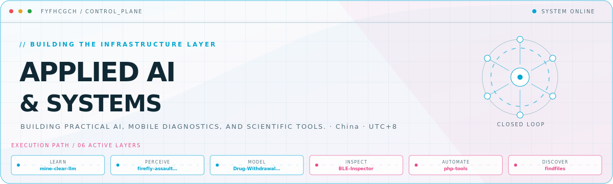

<picture>
  <source media="(prefers-color-scheme: dark)" srcset="assets/hero-dark.svg">
  <source media="(prefers-color-scheme: light)" srcset="assets/hero-light.svg">
  
</picture>

  
  
  

## 01 / GitHub telemetry

  <picture>
    <source media="(prefers-color-scheme: dark)" srcset="https://github-readme-stats-nine-rose-46.vercel.app/api?username=fyfhcgch&amp;show_icons=true&amp;hide_border=true&amp;bg_color=00000000&amp;title_color=00A7D1&amp;text_color=C7D5E0&amp;icon_color=E84A8A&amp;ring_color=00A7D1&amp;v=3">
    <source media="(prefers-color-scheme: light)" srcset="https://github-readme-stats-nine-rose-46.vercel.app/api?username=fyfhcgch&amp;show_icons=true&amp;hide_border=true&amp;bg_color=00000000&amp;title_color=007F9E&amp;text_color=102934&amp;icon_color=D43D74&amp;ring_color=007F9E&amp;v=3">
    
  </picture>
  <picture>
    <source media="(prefers-color-scheme: dark)" srcset="https://github-readme-stats-nine-rose-46.vercel.app/api/top-langs/?username=fyfhcgch&amp;layout=compact&amp;hide_border=true&amp;bg_color=00000000&amp;title_color=00A7D1&amp;text_color=C7D5E0&amp;v=3">
    <source media="(prefers-color-scheme: light)" srcset="https://github-readme-stats-nine-rose-46.vercel.app/api/top-langs/?username=fyfhcgch&amp;layout=compact&amp;hide_border=true&amp;bg_color=00000000&amp;title_color=007F9E&amp;text_color=102934&amp;v=3">
    
  </picture>

## 02 / Commit streak

  <picture>
    <source media="(prefers-color-scheme: dark)" srcset="https://streak-stats.demolab.com?user=fyfhcgch&amp;hide_border=true&amp;background=00000000&amp;stroke=274555&amp;ring=00A7D1&amp;fire=E84A8A&amp;currStreakNum=C7D5E0&amp;sideNums=C7D5E0&amp;currStreakLabel=00A7D1&amp;sideLabels=8AA1AE&amp;dates=6B8491">
    <source media="(prefers-color-scheme: light)" srcset="https://streak-stats.demolab.com?user=fyfhcgch&amp;hide_border=true&amp;background=00000000&amp;stroke=C8D8DF&amp;ring=007F9E&amp;fire=D43D74&amp;currStreakNum=102934&amp;sideNums=102934&amp;currStreakLabel=007F9E&amp;sideLabels=526B78&amp;dates=6B8491">
    
  </picture>

## 03 / Contribution activity

<picture>
  <source media="(prefers-color-scheme: dark)" srcset="https://github-readme-activity-graph.vercel.app/graph?username=fyfhcgch&amp;bg_color=00000000&amp;color=8AA1AE&amp;title_color=00A7D1&amp;line=00A7D1&amp;point=E84A8A&amp;area=true&amp;area_color=00A7D1&amp;hide_border=true&amp;radius=8&amp;height=280&amp;days=31&amp;custom_title=ACTIVITY%20/%20LAST%2031%20DAYS">
  <source media="(prefers-color-scheme: light)" srcset="https://github-readme-activity-graph.vercel.app/graph?username=fyfhcgch&amp;bg_color=00000000&amp;color=526B78&amp;title_color=007F9E&amp;line=007F9E&amp;point=D43D74&amp;area=true&amp;area_color=00A7D1&amp;hide_border=true&amp;radius=8&amp;height=280&amp;days=31&amp;custom_title=ACTIVITY%20/%20LAST%2031%20DAYS">
  
</picture>

## 04 / Contribution matrix

<picture>
  <source media="(prefers-color-scheme: dark)" srcset="https://raw.githubusercontent.com/fyfhcgch/fyfhcgch/output/github-contribution-grid-dark.svg">
  <source media="(prefers-color-scheme: light)" srcset="https://raw.githubusercontent.com/fyfhcgch/fyfhcgch/output/github-contribution-grid.svg">
  
</picture>

## 05 / LeetCode telemetry

  <picture>
    <source media="(prefers-color-scheme: dark)" srcset="https://stats.justsong.cn/api/leetcode?username=fyfhcgch&amp;cn=true&amp;theme=dark">
    <source media="(prefers-color-scheme: light)" srcset="https://stats.justsong.cn/api/leetcode?username=fyfhcgch&amp;cn=true&amp;theme=light">
    
  </picture>

## 06 / Toolchain

  
  
  
  
  
    
  
  
  

## 07 / Uplinks

  
  
  

<!-- Hero generated from profile.yaml with profile-control-plane. Telemetry cards and the contribution matrix update automatically. -->
