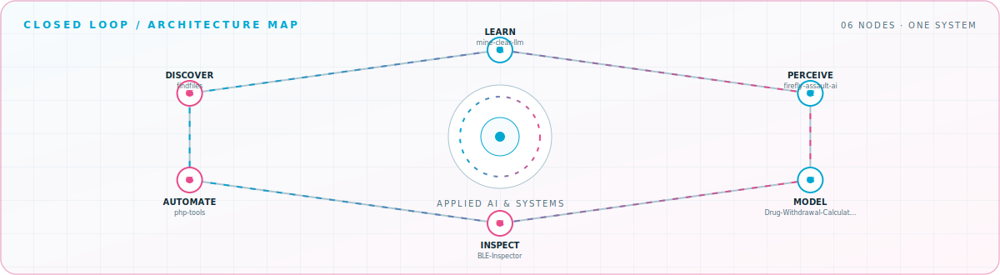

<picture>
  <source media="(prefers-color-scheme: dark)" srcset="assets/hero-dark.svg">
  <source media="(prefers-color-scheme: light)" srcset="assets/hero-light.svg">
  
</picture>

 

Building practical AI, mobile diagnostics, and scientific tools\.

## Flagship systems

| Repository | Role | Purpose |
| --- | --- | --- |
| [`Drug-Withdrawal-Calculator`](https://github.com/fyfhcgch/Drug-Withdrawal-Calculator)  | MODEL | Compare taper schedules and relative withdrawal or rebound risk with PK simulation and uncertainty analysis\. |
| [`mine-clear-llm`](https://github.com/fyfhcgch/mine-clear-llm)  | LEARN | Train and evaluate spatial Minesweeper policies with Gymnasium, PyTorch, DQN, PPO, GRPO, and behavior cloning\. |
| [`BLE-Inspector`](https://github.com/fyfhcgch/BLE-Inspector)  | INSPECT | Capture, inspect, and export Android Bluetooth HCI traffic directly on rooted devices\. |
| [`firefly-assault-ai`](https://github.com/fyfhcgch/firefly-assault-ai)  | PERCEIVE | Explore computer vision, game-state recognition, decision logic, and input control in Python\. |
| [`php-tools`](https://github.com/fyfhcgch/php-tools)  | AUTOMATE | Automate PHP deserialization analysis workflows with Python\. |
| [`findfiles`](https://github.com/fyfhcgch/findfiles)  | DISCOVER | Search local files by extension, keyword, and size through a practical desktop GUI\. |

## Closed-loop architecture

<picture>
  <source media="(prefers-color-scheme: dark)" srcset="assets/closed-loop-dark.svg">
  <source media="(prefers-color-scheme: light)" srcset="assets/closed-loop-light.svg">
  
</picture>

## Module registry

<strong>AI and modeling</strong> · 2 modules

| Module | Purpose |
| --- | --- |
| [`fc-stable-diffusion-18wm`](https://github.com/fyfhcgch/fc-stable-diffusion-18wm) | Deploy Stable Diffusion to Alibaba Cloud Function Compute with Serverless Devs\. |
| [`dianzi-cheng`](https://github.com/fyfhcgch/dianzi-cheng) | An experiment in measuring weight with a mobile phone\. |

<strong>Diagnostics and security</strong> · 2 modules

| Module | Purpose |
| --- | --- |
| [`openshell-exploit`](https://github.com/fyfhcgch/openshell-exploit) | A GitHub Pages probe used to exercise an OpenShell challenge workflow\. |
| [`fastcoll`](https://github.com/fyfhcgch/fastcoll) | C\+\+ fast-collision code with practical usage notes\. |

<strong>Desktop utilities</strong> · 2 modules

| Module | Purpose |
| --- | --- |
| [`spider`](https://github.com/fyfhcgch/spider) | A graphical web-crawling utility written in Python\. |
| [`fyfhcgch.github.io`](https://github.com/fyfhcgch/fyfhcgch.github.io) | Personal notes and project writing published with Jekyll\. |

<a href="https://github.com/fyfhcgch">GitHub</a> · <a href="https://fyfhcgch.github.io">Blog</a> · <a href="mailto:fyfhcgch@qq.com">Email</a>

<!-- Generated by profile-control-plane. Edit profile.yaml, not this file. -->
